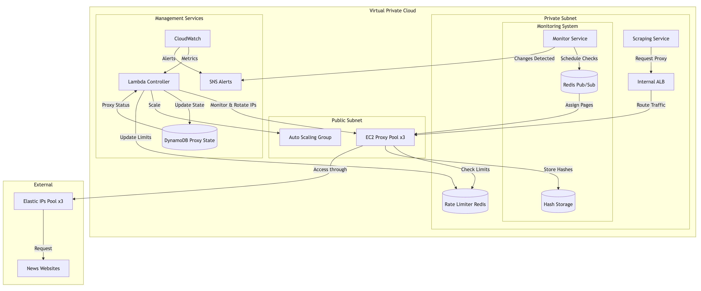

# News Scraping System

A scalable and efficient system for scraping and monitoring news websites. The system is designed to handle high traffic, manage IP rotation, and provide real-time updates from monitored pages.

## System Architecture

### Core Components

1. **Proxy Layer**
   - Auto Scaling Group of EC2 instances acting as proxy servers
   - Each proxy has its own Elastic IP for outbound traffic
   - Lambda controller manages IP rotation and proxy health

2. **Load Balancing**
   - Internal Application Load Balancer distributes requests across proxy servers
   - Ensures even distribution of scraping tasks

3. **Rate Limiting**
   - Redis-based rate limiter controls request frequency
   - Prevents IP blocking through intelligent request throttling
   - Configurable limits per domain and IP address

4. **Monitoring System**
   - Redis Pub/Sub for distributing monitoring tasks
   - Real-time page change detection
   - Adaptive polling intervals based on page update patterns

### Database Schema

1. **Sites Table**
```sql
CREATE TABLE sites (
    site_id UUID PRIMARY KEY,
    site_name VARCHAR(255),
    base_url VARCHAR(255),
    scraping_type VARCHAR(50),  -- FULL_SITE or SPECIFIC_PAGE
    polling_interval INTEGER,    -- in seconds
    pattern_id UUID,
    status VARCHAR(50),         -- ACTIVE or PAUSED
    last_scrape_time TIMESTAMP,
    created_at TIMESTAMP,
    updated_at TIMESTAMP
);
```

2. **Patterns Table**
```sql
CREATE TABLE patterns (
    pattern_id UUID PRIMARY KEY,
    name VARCHAR(255),
    description TEXT,
    content_selectors JSON,     -- content extraction rules
    pagination_rules JSON,      -- page navigation rules
    validation_rules JSON,      -- data validation rules
    created_at TIMESTAMP,
    updated_at TIMESTAMP
);
```

3. **Monitored Pages Table**
```sql
CREATE TABLE monitored_pages (
    page_id UUID PRIMARY KEY,
    site_id UUID,
    url VARCHAR(255),
    pattern_id UUID,
    check_interval INTEGER,     -- in seconds
    last_check_time TIMESTAMP,
    last_change_time TIMESTAMP,
    status VARCHAR(50),
    FOREIGN KEY (site_id) REFERENCES sites(site_id),
    FOREIGN KEY (pattern_id) REFERENCES patterns(pattern_id)
);
```

## How It Works

### Scraping Workflow

1. **Configuration**
   - Admin configures sites and patterns through admin panel
   - Sets scraping type (full site or specific pages)
   - Defines polling intervals and extraction rules

2. **Task Distribution**
   - System creates scraping tasks based on configurations
   - Tasks are distributed to proxy servers via Redis Pub/Sub
   - Rate limiter ensures compliance with site limits

3. **Content Extraction**
   - Proxy servers fetch content using configured patterns
   - Content is validated and processed
   - Changes are detected and stored

### Monitoring Workflow

1. **Page Monitoring**
   - System tracks specific pages for changes
   - Uses configured check intervals
   - Distributes monitoring tasks across proxy servers

2. **Change Detection**
   - Content is fetched and compared with previous version
   - Changes trigger notifications and content updates
   - System adapts check intervals based on change patterns

### IP Rotation

1. **Proxy Management**
   - Each proxy server has a dedicated Elastic IP
   - Lambda controller monitors proxy health
   - Automatic IP rotation when needed:
      - Rate limits reached
      - IP blocked by target site
      - Regular rotation schedule

2. **Traffic Distribution**
   - Internal ALB routes traffic across proxy servers
   - Health checks ensure reliability
   - Auto Scaling maintains proxy pool size

## Administration

### Admin Panel Features

1. **Site Management**
   - Add/edit/remove sites
   - Configure scraping patterns
   - Set polling intervals
   - View scraping status

2. **Pattern Management**
   - Create and edit extraction patterns
   - Define navigation rules
   - see more [Pattern Management.md](Pattern%20Management.md)

3. **Monitoring**
   - View active scraping tasks
   - Monitor proxy health
   - Track rate limits
   - View change detection stats

### Proxy Management

1. **Health Monitoring**
   - Track proxy success rates
   - Monitor IP block status
   - View request distribution

2. **IP Management**
   - View active Elastic IPs
   - Track IP rotation history
   - Configure rotation rules

## Scalability and Performance

- Auto Scaling based on load
- Distributed rate limiting
- Efficient change detection
- Adaptive polling intervals
- Load balanced proxy layer

## Security Features

- Private subnet for core services
- Public proxies with controlled access
- Rate limiting protection
- IP rotation for anonymity
- Request validation and sanitization

## Monitoring and Alerts

- CloudWatch metrics
- SNS notifications
- Proxy health alerts
- Rate limit warnings
- Change detection notifications


## Diagram:
