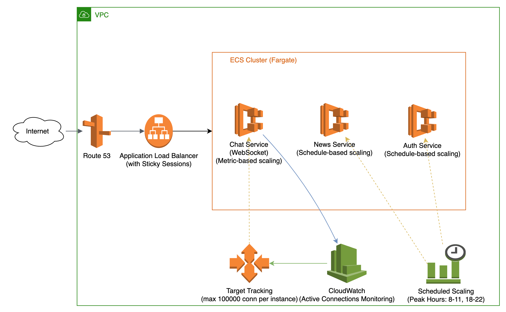

Overall architecture

# News Website Backend Architecture

A scalable news website backend system designed to handle high traffic loads while maintaining cost efficiency. The system supports news scraping, user authentication, real-time chat, and administrative monitoring capabilities.

## System Architecture

### Components

- **Frontend**: Served through AWS Route 53 and Application Load Balancer
- **Backend Services** (ECS Fargate):
    - News Service (Schedule-based scaling)
    - Chat Service (WebSocket with metric-based scaling)
    - Auth Service (Schedule-based scaling)
- **Monitoring**: CloudWatch for metrics and Target Tracking
- **Database**: DynamoDB for proxy state management
- **Caching**: Redis for rate limiting and pub/sub

### Scaling Strategy

- WebSocket connections: Up to 100,000 per instance
- Peak hours handling: 8-11, 18-22
- Auto-scaling based on metrics and schedules

## Infrastructure

- AWS VPC with public and private subnets
- ECS Cluster with Fargate for container management
- Application Load Balancer with sticky sessions
- CloudWatch for monitoring and alerts

## Technologies Used

- **AWS Services**: ECS, ALB, CloudWatch, Route 53
- **Databases**: Redis, DynamoDB
- **Infrastructure**: Docker, VPC, Auto Scaling Groups

## Documentation

Detailed documentation available in separate markdown files:
- [News Scraping System](News%20Scraping%20System.md)
- [Chat Service Architecture](Chat%20Service%20Architecture.md)
- [Example Cost Calculation](Example%20cost%20calculation.md)

